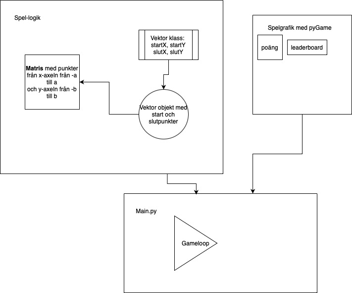

# VECTOR GAME
This is part of Toto Roomi and Harald Olins Bachelor thesis on gamification and it's borders. When is digital learning solely a game without the learning? When is it the perfect intersection between game and learning. Is all digital learning a game? Do all games have potential to be learning experiences?

In this project we demonstrate bad gamification wherein a learning experience is squandered by creating a game that neither follows game design rules nor behavioural science on learning. This is the fault of modern gamification, what __ calls "rhetorical gamification", that is, gamification for the hell of it.

The game is about simple Vector addition, subtraction and multiplication. You learn how to do these things visually.

